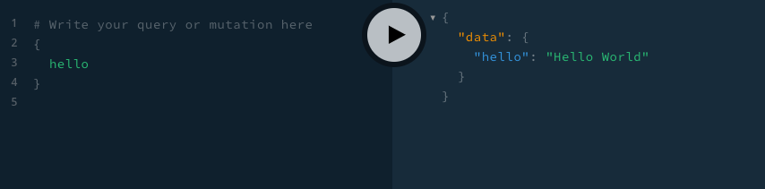

# TypeScript Lambda GraphQL Hello World Example

Simple GraphQL Lambda function example with TypeScript. GraphQL is powered by apollo-server-lambda. return hello world with Query. It will give the endpoint for post as well as get for the playground.



## Tools

- yarn
- serverless
- apollo-server-lambda
- graphql-codegen

## Installation

```bash
yarn install
```

## Testing lambda locally

Use Serverless Offline.

```bash
# Start local lambda by using sls offline command
sls offline start -r ap-southeast-1 --stage test

# Test with curl
curl -X POST http://localhost:3000/test/graphql/hello --data '{"query": "{hello}"}'
```

Playground is available.

Go to `http://localhost:3000/test/graphql`. You may need to change the actual query url within the query tab to `http://localhost:3000/test/graphql/hello`

## Deploy

In `config/account.yml`, you need to fill account, aws region and s3 base url. Make sure your AWS CLI is configured correctly. Then, use sls command to deploy.

```bash
sls deploy --stage test

# Account can be overriden by passing the --account in sls command
sls deploy --stage test --acount <your AWS account number>
```
